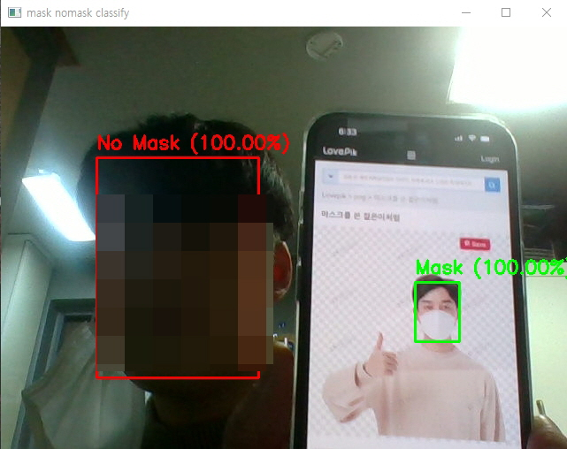
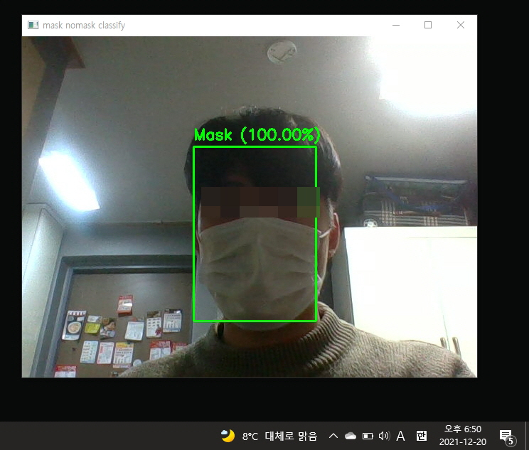

# **Mask detection Management**

## **Basic information**

- 14109344 Seong Yeon-seok

- Opensourcesoftware Project

---

## **Project overview**
 
 학교 도서관을 보면 아래와 같은 사진을 확인 할 수 있습니다. 대부분의 사람들은 잘 지키지만 가끔 취식을 하거나 답답하다는 핑계로 코스크나 턱스크를 하는 사람들을 발견 할 수 있습니다. 하지만 어느 누구도 제지를 하거나 실제로 적발하여 퇴실 및 출입제한을 하는 경우는 없었습니다. 사실 관리자가 이 넓은 구역을 담당하는 것은 어려울 것 입니다. 따라서 이를 무인으로 탐지하여 관리자에게 알림을 주는 프로그램이 있으면 어떨까 해서 이와 같은 프로젝트를 구현해보았습니다. 

---

## **Configuration**

 

- [Face Mask Detection data set](https://www.kaggle.com/ashishjangra27/face-mask-12k-images-dataset) 

    먼저 마스크를 썼는지 안썼는지에 대해 판별하기 위해 데이터가 필요하여 kaggle에서 적당한 크기의 데이터를 선정하였습니다. 11800여장의 적절한 크기의 데이터로 이루어져있고 train, validation, test set이 각 폴더 별로 학습하기 쉽게 나뉘어져 있어 이 data set을 선정하였습니다.

- **data_to_csv.py**

    데이터를 받아보니 csv 파일이 없고 이름이 중복된 것들이 많아 python을 이용해 정리하였습니다. 

- **mask_detaction.ipynb**

    정리한 데이터를 colab을 이용해 마스크를 낀 사람과 그렇지 않은 사람을 구분하기 위한 학습을 하였습니다. 

- **best_model.h5**

    학습을 통해 가장 좋은 validation loss를 가진 모델을 저장하였습니다.

    *v2. 이 파일의 경우 용량이 커 분할하여 압축 파일을 올립니다.*

- **create_token.py**

    카카오톡으로 메시지를 보내기 위해 카카오 API를 사용하기 위한 사용자 토큰을 발급 받았습니다. 중요 정보는 삭제하였습니다.

- **kakao_code.json**

    발급 받은 카카오 사용자 토큰입니다. 역시 중요 정보는 삭제하였습니다.

- **send_message.py**

    발급 받은 토큰을 이용해 나에게 메시지 보내기를 클래스로 구현하였습니다.

- **exit_sound.mp3**

    사용자에게 경고를 주기위한 경고 음성입니다. 

- **warning_sound.mp3**

    사용자에게 퇴출 명령을 내리고 관리자를 호출 중이라는 것을 알리는 음성입니다.

- **detect mask.py**

    학습한 모델과 open cv의 cvlib 라이브러리를 활용하여 마스크 착용 여부를 판단하고 이에 대해 경고를 하고 관리자에게 메시지를 보내는 메인 코드입니다. 

---

## **Code description** 

### 1. data_to_csv.py 
    - kaggle에서 다운로드 받은 이미지 데이텅 중복된 이름의 데이터가 다수 존재
    - 각 폴더 마다 이미지의 이름을 다르게 설정 (data set{number}.jpg)
    - 저장한 이미지 파일에 대한 label값을 설정하여 csv 파일로 저장
    - 마스크를 썼으면 label에 1, 안썼으면 0
    - train, test, valiation을 폴더마다 따로 적용
직접 작성한 코드

### 2. mask_detaction.ipynb  
    - 정리한 데이터를 colab에서 모델을 통해 학습하기 위해 google drive로 이동
    - csv 파일을 불러왔으나 이미 폴더별로 잘 정리가 되어 있어 필요 없어짐.
    - 모델을 학습시켰을 때 validation에서 error가 발생했는데 검색결과 열 수 없는 이미지 파일이라면 오류가 날 수 있다고 하여 이를 찾아주는 코드를 작성
    - 비교적 단순한 모델이기 때문에 복잡한 모델보다는 비교적 단순한 네트워크를 가진 vgg19 사용.
    - pre_train된 keras의 VGG19 모델을 불러 온 다음 Pre_train된 모델은 freeze
    -  더 나은 학습을 위해 2개의 Dense layer를 추가하고 activation function은 ReLU로 설정
    - 마지막 output layer는 2개의 class를 구분한다. optimizer는 RMSProp와 Momemtum의 장점을 가진 Adam을 사용, 이때의 learning rate는 0.00001로 설정.
    - Loss는 data의 폴더를 살펴보면 withmask, withoutmask로 라벨이 [0,1] or [1,0] 의 형태이면서 outlayer가 softmax이므로 categorical_crossentropy를 사용
    - early stopping을 사용했고 validation loss가 가장 적을 때, 그리고 5번의 epoch동안 더 좋아지지 않으면 학습을 중지시키도록 함
    - validation loss가 가장 좋을 때를 저장하기 위해 chechpoint 사용. best_model.h5로 저장.
    - 처음 model.summary를 확인하면 pre_train 된 모델을 freeze 시켰기 떄문에 훈련 되는 가중치 수가 6인 것을 확인 할 수 있음.
    - 더 나은 학습을 위해 ImageDataGenerator 사용, 이 때 디렉토리에의 경로를 전달받아 증강된 데이터의 배치를 생성하여 이를 학습에 사용. 자세한 augmentation 인수는 코드 참조.
    - confusion matrix를 그렸을 때 accuracy가 안 맞는 오류 때문에 generator2 생성.
    - image size는 VGG19의 input 값은 224x224, batch_size = 64, epoch은 30으로 설정
    - 처음 학습은 accuracy 70% 정도를 목표로 10 epoch을 돌렸으나 생각보다 좋은 결과 나타남.
    Epoch 10/10
    156/156 [==============================] - 123s 786ms/step - loss: 0.0577 - accuracy: 0.9781 - val_loss: 0.0627 - val_accuracy: 0.9766 
    - 그 후 모델의 fine-tuning을 위해 pre_train된 모델을 unfreeze 후 callback 함수를 사용하여 재학습.
    - unfreeze 후 훈련되는 가중치 수는 전보다 늘어난 38임을 확인 할 수 있음.
    - early stopping을 시켰으나 epoch 30이 될 때까지 validation loss가 낮아지먄 학습 완료
    Epoch 00030: val_loss did not improve from 0.00006
    156/156 [==============================] - 126s 807ms/step - loss: 4.6579e-04 - accuracy: 0.9999 - val_loss: 8.8889e-04 - val_accuracy: 1.0000
    - 가장 학습이 잘 된 모델을 불러와 validation data와 test data에 대해 confusion matrix를 그려보니 거의 완벽하게 구분하는 것을 확인 할 수 있었음.
기계학습 시간에 프로젝트한 코드를 바탕으로 구현.

### 3. best_model.h5  
    - 모델 학습 시 chechpoint를 사용하여 val_loss: 8.8889e-04 - val_accuracy: 1.0000의 가장 좋은 성능을 가진 모델을 저장한 파일.
 *v2. 이 파일의 경우 용량이 커 분할하여 압축 파일을 올립니다.*

### 4. create_token.py  
    - 카카오 API를 사용하기 위한 토큰 발급 코드
    - 현재는 시간이 지나 refresh_token으로 갱신
[https://developers.kakao.com/docs/latest/ko/kakaologin/rest-api#get-token-info] 참조

### 5. kakao_code.json  
    - 토큰을 발급 받으면 생성되는 json 파일, 토큰이 생성되어 있음.

### 6. send_message.py  
    - 클래스로 구현, 입력한 좌석번호를 받아 카카오톡으로 메시지를 보냄.
[https://developers.kakao.com/docs/latest/ko/message/rest-api] 참조

### 7. exit_sound.mp3  
    - 마스크를 3회 미착용시 나오는 퇴출 및 관리자 호출음.
    - 파파고에서 나오는 음성을 녹음한 mp3 파일.

### 8. warning_sound.mp3 
    - 마스크를 미착용시 나오는 경고음.
    - 파파고에서 나오는 음성을 녹음한 mp3 파일.

### 9. detect mask.py  
    - opencv와 cvlib lib를 활용하여 얼굴을 검출하고 미리 학습 된 모델이 predict하여  마스크 착용 여부 확인.
    - 만약 
    - 다양한 알림창 및 경고창 추가
    - 가장 먼저 좌석번호 입력.
    - 마스크 미착용 시 모델이 이를 판단하고 바로 경고창과 warning_sound가 울림.
    - 마스크를 다시 착용하고 확인 버튼을 클릭 시까지 warning_sound가 울림.
    - 2차 경고까지는 동일, 3차 경고 시 exit_sound가 울리며 관리자에게 좌석번호와 함께 조치를 취해달라는 메시지를 보내도록 구현.
[https://bskyvision.com/1082] 참조

---

## **Image**
- mask detection example

프로그램 시작 전 예제 화면입니다. 인터넷 사진은 저작권이 없는 사진들 입니다.
또한 저의 얼굴도 모자이크 하였습니다.

- 프로그램 시작

- 좌석번호 입력

- 알림창

- mask detection 작동 중

- 1차 경고

- 마스크 착용 후 확인 버튼 클릭

- 2차 경고

- 마스크 착용 후 확인 버튼 클릭

- 3차 퇴출

- 메시지 전송 

