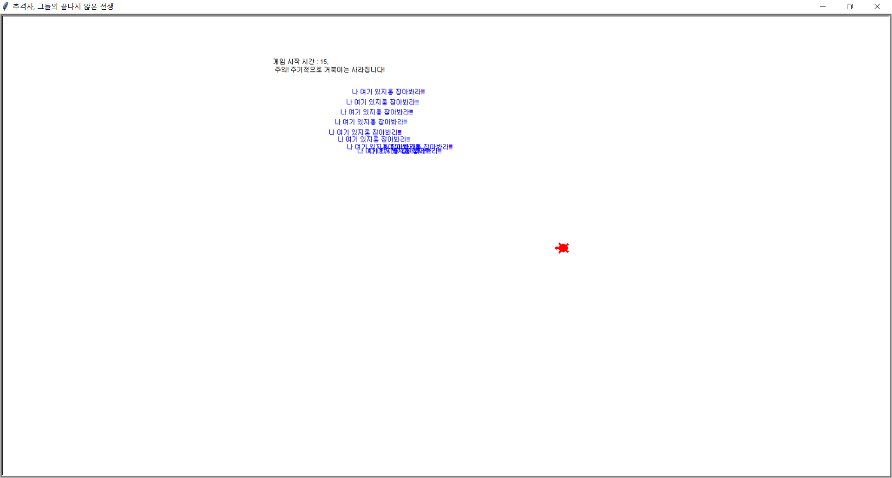

# Turtle Runaway
## 14109344 성연석

### 요구사항
> 1. 타이머 추가
> ```        
> self.drawer.write(f'게임 시작 시간 : {elapse:.0f}, \n 주의! 주기적으로 거북이는 사라집니다!')
> ```
> 게임 시작 시간과 주의 사항 추가

> 2. 똑똑한 거북이
> ```       
>if int(elapse) != 0 and int(elapse) % 10 == 0: 
>   if self.runner.isvisible():
>       self.runner.hideturtle()
>   else:
>       self.runner.showturtle()
>       self.runner.clear()
>```
> 10초마다 사라지고 나타나고를 반복, 이 때 0초에 조건읆 만족하지 않기 위해서 조건 추가
> 또, 한 번 움직일 때 속도를 증가
>```        
>if self.runner.isvisible() == False:
>   self.runner.write("나 여기 있지롱 잡아봐라!!!")
> ```
> 도망자가 사라졌을 때 추격자가 힌트를 얻을 수 있도록 도망자가 계속 외침.<br>

>3. 점수 개념 도입
>```       
>if abs(self.dx**3) + abs(self.dy**3) < self.catch_radius2:
>   self.drawer.clear()
>   result = 100 - int(elapse)
>   self.chaser.write("감히 날 놀려? 너 일로와.")
>   self.drawer.write(f'당신의 점수는 : {result}', False, 'left', ('굴림', 20,))
>   self.done()
>```
>더 가까이 닿았을 때 잡히도록 수정.<br>
>추격자가 도망자를 잡으면 게임이 종료,  점수가 나오고 점수는 105점 만점, (100 - 게임을 한 시간)으로 삽입,  

> cf) title을 변경
> <br>
>
><br>
>참고사이트 : <a>https://docs.python.org/ko/dev/library/turtle.html#turtle.done
